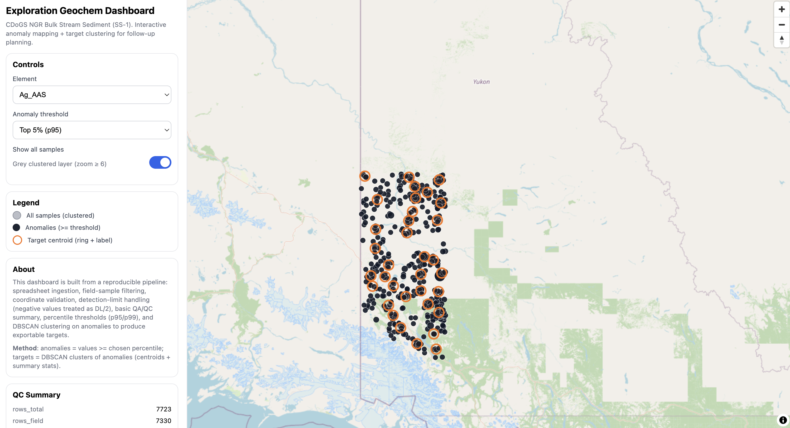

# Exploration Geochem Dashboard

Deployed to: https://cdogs-geochem-dashboard.vercel.app/

I built this to support a typical exploration "field assistant" workflow: take a geochem spreadsheet, clean it up, check for obvious issues, then map the results so anomalies and follow-up areas are easy to review.

## Data source
This dashboard uses public CDoGS data from Natural Resources Canada:
- Survey metadata: https://geochem.nrcan.gc.ca/cdogs/content/svy_dat/svy210194_e.dat.htm
- Download Analytical Sample Bundle metadata: https://geochem.nrcan.gc.ca/cdogs/content/bdl/bdl210620_e.htm

Specific survey used: NGR stream sediment and water survey (NTS 115F,G), southwest Yukon, 1986.

I used the "Negative" bundle, where values below the lower detection limit are reported as negative numbers (a common convention).

Using the included dataset, it maps **7,330 field samples** (out of 7,723 total rows) and produces **400 follow-up targets**.



## What you can do with it
- Choose an element from the dropdown.
- Choose how strict the anomaly cutoff is (less strict vs more strict).
- See anomalies on the map and click targets to zoom in.
- Download the generated files (samples, targets, basic stats, QC summary).

## Quick start
```bash
python3 -m venv .venv
source .venv/bin/activate
pip install -r requirements.txt

python3 pipeline/run_pipeline.py \
  --input data/raw/bdl210620_pkg_0412a.xlsx \
  --out web/data

# run the dashboard locally
python3 -m http.server 8000 --directory web
# open http://localhost:8000
```

## Files it generates
Created in `web/data/`:
- `samples.geojson`: sample locations
- `targets.geojson`: follow-up target points
- `stats.json`: simple per-element summary numbers
- `qc_summary.json`: basic QC counts (row counts, missing coords, duplicates)
- `field_ops.csv`: a simple grouped manifest for field planning
